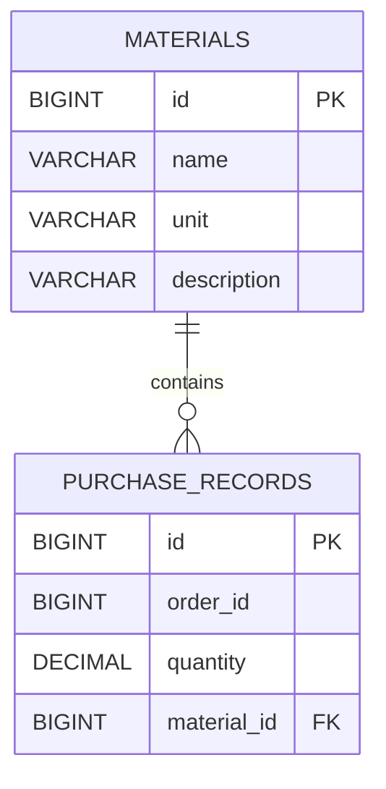

# Database Schema

Цей документ описує схему бази даних додатка Block2.

База даних реалізована на базі PostgreSQL, а управління схемою здійснюється за допомогою Liquibase.

## Entity Relationship Diagram



## Tables

### materials

Зберігає інформацію про матеріали, які можуть використовуватися в записах про закупівлі.

| Column      | Type           | Constraints                 | Description                                       |
| ----------- |----------------|-----------------------------|---------------------------------------------------|
| id          | BIGINT         | PRIMARY KEY, AUTO INCREMENT | Унікальний ідентифікатор матеріалу                |
| name        | VARCHAR(255)   | NOT NULL                    | Унікальна назва матеріалу,без урахування регістру |
| unit        | VARCHAR(50)    | NOT NULL                    | Одиниця виміру: `KG`, `LITERS`, `METERS`, `PCS`   |
| description | VARCHAR(1000)  | NULL                        | Опис матеріалу                                    |

### purchase_records

Зберігає окреми позиції (рядок) виробничого замовлення на закупівлю матеріалів, з урахуванням необхідної кількості.

| Column      | Type          | Constraints                 | Description                               |
| ----------- | ------------- | --------------------------- |-------------------------------------------|
| id          | BIGINT        | PRIMARY KEY, AUTO INCREMENT | Унікальний ідентифікатор запису закупівлі |
| order_id    | BIGINT        | NOT NULL                    | Ідентифікатор замовлення                  |
| quantity    | DECIMAL(19,3) | NOT NULL                    | Необхідна кількість матеріалу             |
| material_id | BIGINT        | NOT NULL, FOREIGN KEY       | Посилання на `materials.id`               |

## Relationships

### PURCHASE_RECORDS to MATERIALS 

Зв'язок "Багато до одного" (Many-to-One)
* На один Material може посилатися нуль або кілька записів PurchaseRecord.
* Кожен PurchaseRecord посилається рівно на один Material.
* Зв'язок реалізовано через зовнішній ключ material_id.
* Зовнішній ключ посилається на materials.id.

## Constraints

### Material name uniqueness

Унікальність назви матеріалу

Назви матеріалів є унікальними без урахування регістру.
У базі даних створено унікальний функціональний індекс:
```
CREATE UNIQUE INDEX uk_material_name_lower
    ON materials (LOWER(name));
```

### Purchase record uniqueness

Комбінація:

```text
order_id + material_id
```

є унікальною.

Це означає, що той самий матеріал не може зустрічатися більше одного разу в межах одного замовлення.

Це обмеження має назву:

```text
uk_order_material
```

### Foreign key

`purchase_records.material_id` посилається на `materials.id`.
Запис про закупівлю не може посилатися на матеріал, якого не існує.
Видалення матеріалу, на який посилаються записи про закупівлю, заборонено.

## Indexes

Для бази даних створено такі індекси:

| Index                           | Table            | Columns               | Purpose                                                                |
| ------------------------------- | ---------------- | --------------------- |--------------------purchase_records------------------------------------|
| `idx_purchase_records_material` | purchase_records | material_id           | Ефективний пошук матеріалу та виконання з'єднань (joins)               |
| `idx_purchase_records_order`    | purchase_records | order_id              | Ефективна фільтрація за замовленням                                    |
| `uk_order_material`             | purchase_records | order_id, material_id | Забезпечує унікальність комбінації order_id + material_id              |
| `uk_material_name_lower`        | materials        | LOWER(name)           | Забезпечує унікальність назви матеріалу без урахування регістру        |


Окремий індекс для стовпця quantity не створюється.
Поле quantity використовується для необов'язкової фільтрації за діапазоном. Додатковий індекс не потрібен для поточного навантаження на додаток і обсягу даних. Рішення про індексування повинні базуватися на вибірковості запитів та реальному навантаженні на базу даних, а не лише на типі даних.

## Database-related Application Flow

* Створюється Material і зберігається в таблиці materials.
* Створюється PurchaseRecord з параметрами orderId, materialId та quantity.
* Додаток перевіряє, чи існує матеріал, на який посилається запис.
* Запис про закупівлю зберігається в таблицю purchase_records.
* Під час запитів списку необов'язкові фільтри застосовуються на рівні запитів до бази даних.
* Пагінація також виконується на рівні бази даних.
* Звіти використовують ту саму логіку фільтрації та містять усі відповідні записи про закупівлі.
* Імпорт JSON валідує окремі записи та зберігає валідні дані.

