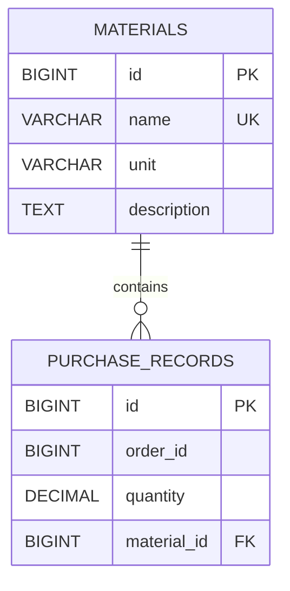

# Database Schema

This document describes the database schema of the **Block2** application.

The database is implemented in **PostgreSQL** and the schema is managed by **Liquibase**.

## Entity Relationship Diagram



## Tables

### materials

Stores information about materials that can be used in purchase records.

| Column      | Type         | Constraints                 | Description                                          |
| ----------- | ------------ | --------------------------- | ---------------------------------------------------- |
| id          | BIGINT       | PRIMARY KEY, AUTO INCREMENT | Unique material identifier                           |
| name        | VARCHAR(255) | NOT NULL, UNIQUE            | Unique material name                                 |
| unit        | VARCHAR(50)  | NOT NULL                    | Unit of measurement: `KG`, `LITERS`, `METERS`, `PCS` |
| description | TEXT         | NULL                        | Material description                                 |

### purchase_records

Stores individual purchase positions belonging to production orders.

| Column      | Type          | Constraints                 | Description                       |
| ----------- | ------------- | --------------------------- | --------------------------------- |
| id          | BIGINT        | PRIMARY KEY, AUTO INCREMENT | Unique purchase record identifier |
| order_id    | BIGINT        | NOT NULL                    | Production order identifier       |
| quantity    | DECIMAL(19,3) | NOT NULL                    | Required material quantity        |
| material_id | BIGINT        | NOT NULL, FOREIGN KEY       | Reference to `materials.id`       |

## Relationships

### MATERIALS to PURCHASE_RECORDS

**One-to-Many relationship**

* One `Material` can be referenced by zero or many `PurchaseRecord` records.
* Each `PurchaseRecord` references exactly one `Material`.
* The relationship is implemented through the `material_id` foreign key.
* The foreign key references `materials.id`.

```text
materials.id
     │
     │ 1
     │
     │
     │ N
purchase_records.material_id
```

## Constraints

### Material name uniqueness

The `materials.name` column has a unique constraint.

This prevents multiple materials with the same name from being stored in the database.

### Purchase record uniqueness

The combination of:

```text
order_id + material_id
```

is unique.

This means that the same material cannot occur more than once within the same production order.

The constraint is named:

```text
uk_order_material
```

### Foreign key

`purchase_records.material_id` references `materials.id`.

A purchase record cannot reference a material that does not exist.

Deleting a material that is referenced by purchase records is not allowed.

## Indexes

The following indexes are created for the database:

| Index                              | Table            | Columns               | Purpose                                                       |
| ---------------------------------- | ---------------- | --------------------- | ------------------------------------------------------------- |
| `idx_purchase_records_material_id` | purchase_records | material_id           | Efficient material lookup and joins                           |
| `idx_purchase_records_order_id`    | purchase_records | order_id              | Efficient filtering by production order                       |
| `uk_order_material`                | purchase_records | order_id, material_id | Enforces uniqueness and supports lookup by order and material |
| unique index                       | materials        | name                  | Enforces material name uniqueness                             |

No separate index is created for `quantity`.

The `quantity` field is used for optional range filtering. An additional index is not required for the current application workload and dataset size. Indexing decisions should be based on query selectivity and actual database workload rather than on the data type alone.

## Database Schema Management

Database schema creation and initial data insertion are handled by **Liquibase**.

The application uses:

```properties
spring.jpa.hibernate.ddl-auto=validate
```

Hibernate therefore validates the existing database schema instead of creating or modifying it.

Liquibase is responsible for:

* creating the `materials` table;
* creating the `purchase_records` table;
* creating primary keys;
* creating foreign keys;
* creating unique constraints;
* creating indexes;
* inserting initial material data.

## Seed Data

The database is initialized with several materials when the application starts through Liquibase migrations.

Example materials include:

* Steel Beam
* Cement
* Copper Wire

The exact seed data is defined in the Liquibase changelog.

## Database-related Application Flow

1. A `Material` is created and stored in the `materials` table.
2. A `PurchaseRecord` is created with an `orderId`, `materialId` and `quantity`.
3. The application verifies that the referenced material exists.
4. The purchase record is stored in `purchase_records`.
5. During list requests, optional filters are applied at the database query level.
6. Pagination is also performed at the database level.
7. Reports use the same filtering logic and contain all matching purchase records.
8. JSON import validates individual records and persists valid records.

## Entity Model

The database corresponds to the following application model:

```text
PurchaseRecord
    │
    │ Many-to-One
    ▼
Material
```

`PurchaseRecord` is the main entity of the project.

`Material` is the secondary entity referenced by `PurchaseRecord`.
